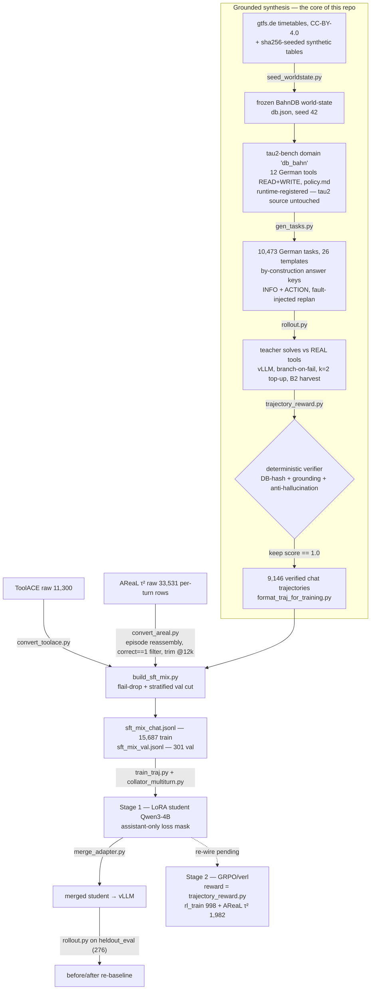

# Agentic SLM Training Pipeline

> Training a **small-language-model orchestrator agent** — multi-step planning, tool-calling and
> self-reflection/replan — for an internal **Deutsche Bahn employee assistant**.


## What is this?

A full training pipeline for a **4B agent** that drives real German DB tools — *Fahrplan*, *Zugstandort*,
*Wartung*, *Personal* — planning across several tool calls, recovering from errors and replanning when a
tool rejects an action. It runs on a single **GB10 (DGX Spark, 128 GB unified memory, sm_121)** with vLLM
serving and a [τ²-bench](https://github.com/sierra-research/tau2-bench)-based tool sandbox.

**Two-stage training plan**

1. **Stage 1 — SFT (LoRA)** on a **3-leg data mix**: public tool-calling breadth, τ²-bench dialogue
   flows, and — the core of this repo — **self-synthesized, verifier-gated German DB trajectories**.
2. **Stage 2 — GRPO/verl RL**, reward = the same deterministic trajectory verifier / τ²-bench success.
   *Status: **pending clean rebuild** — the SQL-era verl runner was removed (2026-07-15 cleanup); the
   validated GB10/verl recipe lives in
   [experiments-verl_RL_lora-grpo.md](docs/text2sql-experiments/experiments-verl_RL_lora-grpo.md), the frozen
   `text2sql-grpo:verl` image + `Dockerfile.grpo` stay.*

## Architecture — grounded synthesis → SFT mix → student

The core idea: **generate tasks whose correct answer is known by construction**, let a strong teacher solve
them against the *real* tools, and keep only trajectories a deterministic verifier confirms. Those verified
German trajectories are then **mixed** with two public legs before the student sees them.



## The SFT data mix (3 legs)

What `build_sft_mix.py` actually assembles into `data/final/sft_mix_chat.jsonl` (≠ the raw pull counts —
those live in the [acquisition record](docs/agentic-datasets-explained.md#anhang-a--akquise-record-gemergt-aus-agentic-sft-data-basismd-2026-07-15)):

| # | Leg | Source | Teaches | Train | Val | Tokens |
|---|-----|--------|---------|-------|-----|--------|
| 1 | **db_bahn** ⭐ | self-synthesized (this repo) | verifier-gated German DB trajectories (≤ 5.9k tok) | **8,964** | 172 | **59 %** |
| 2 | AReaL (τ²-bench) | [`inclusionAI/AReaL-tau2-data`](https://huggingface.co/datasets/inclusionAI/AReaL-tau2-data) | multi-turn dialogue / policy adherence (episodes **up to 12k tok**) | **2,013** | 39 | 34 % |
| 3 | ToolACE | [`Team-ACE/ToolACE`](https://huggingface.co/datasets/Team-ACE/ToolACE) | tool-call basics + irrelevance (~0.8k tok) | **4,710** | 90 | 6 % |
| | **Total** | | | **15,687** | **301** | 100 % |

58 % multi-turn (≥ 3 assistant turns); val stratified per source, never in the gradient. The token share is
what drives the run's wall-clock — see [why it takes 41.7 h](docs/SFT-Training-Uebersicht.md).

**TaskBench is deliberately not a leg** — its rows are plans, not executable trajectories → moved to the eval
shelf ([why](docs/agentic-datasets-explained.md)). RL task pools (`rl_train` 998 + AReaL τ² 1,982) are listed in the
[one-pager](docs/SFT-Training-Uebersicht.md).

## The db_bahn synthesis core

- **Frozen world-state.** Real [gtfs.de](https://gtfs.de) *de_fv* timetables (CC-BY-4.0) plus `sha256`-seeded
  synthetic tables (vehicles, staff, shifts, maintenance) → one byte-reproducible `db.json` (seed 42).
- **A τ²-bench domain, `db_bahn`.** **12 German tools** (READ + WRITE) with a German `policy.md`, *runtime-registered*
  so the upstream tau2 source stays untouched. WRITE tools enforce real rules (role-gate, product qualification,
  duplicate-gate, terminal status) → rejected actions force the agent to **replan**.
- **26 task templates** with **by-construction answer keys** (INFO + ACTION; ~40 % carry an injected fault —
  incl. a dedicated lookup-by-ID template that guarantees clean demonstrations of `mitarbeiter_details`).
- **A deterministic outcome-verifier** ([evaluation/trajectory_reward.py](evaluation/trajectory_reward.py)):
  DB-state hash + tool-grounding + anti-hallucination → only `score == 1.0` trajectories survive.
- **Robust rollout** ([sdg_pipeline/db_bahn/rollout.py](sdg_pipeline/db_bahn/rollout.py)): `branch-on-fail`
  (rewind to the gold-path prefix, resample the tail), `k=2` top-up on the failed subset, and `B2` recovery-harvest
  (keep a mistake **and** its correction → self-correction traces). Everything is logged to MLflow (file-store).

**Tools (12)**

| Category | # | Tools |
|----------|---|-------|
| Lookup (READ, by id) | 6 | `fahrplan`, `verspaetung`, `zugstandort`, `wartung_status`, `mitarbeiter_info`, `mitarbeiter_details` |
| Search (READ, by filter) | 3 | `zuege_suchen`, `mitarbeiter_suchen`, `wartung_liste` |
| Write (rule-gated) | 3 | `wartung_einplanen`, `crew_zuweisen`, `wartung_status_setzen` |

**Splits** (from `gen_tasks.py`; disjoint by construction, HARD-FAIL-checked)

| Split | Tasks | Purpose |
|-------|-------|---------|
| `sft_train` | 9,199 | teacher rollouts → SFT traces |
| `rl_train` | 998 | Stage-2 GRPO |
| `heldout_eval` | 276 | before/after held-out eval |
| `bakeoff_dev` | 26 | teacher bake-off + CPU smoke (⊆ `sft_train`, non-disjoint) |

Pool: **10,473 unique tasks** (`sft`/`rl`/`heldout` disjoint; `bakeoff_dev` is a stratified subset of `sft_train`).

## Setup

Prereqs: Docker + Compose (services: `sdg`, `training`, `vllm`, `grpo`, `mlflow`) and a **Python ≥ 3.12 venv
for τ²-bench** (its `requires-python >=3.12`; the pinned training stack stays isolated per the repo's venv doctrine).

```bash
python3.12 -m venv .venv-tau2
git clone https://github.com/sierra-research/tau2-bench.git /tmp/tau2-bench   # pin commit 1901a30
./.venv-tau2/bin/pip install /tmp/tau2-bench
```

All `ops/` scripts use `.venv-tau2/` by default (override with `TAU2PY=/path/to/python`).
`config/pipeline_config.yaml` is the single config — no secrets needed (the teacher is local vLLM).

**Import convention:** repo scripts import the shared `data_pipeline/common.py`, so host invocations
need the repo root on the path — prefix with `PYTHONPATH=.` (as all examples below do), or install
once via `pip install -e . --no-deps` (containers bake `PYTHONPATH=/app`, ops scripts set it).

## Pipeline steps

**CPU** (host `python3` unless noted `[TAU2PY]`):

```bash
# 0) public legs -> data/raw/{toolace,areal}/   (areal = ~970 MB snapshot)
PYTHONPATH=. python3 data_pipeline/prepare_agentic_data.py --config config/pipeline_config.yaml --dataset all

# 0b) validate the AReaL leg (streaming schema/integrity/referential checks -> validation_report.json)
PYTHONPATH=. ./.venv-tau2/bin/python data_pipeline/validate_areal.py \
  --config config/pipeline_config.yaml

# 1) frozen world-state from the GTFS snapshot (byte-reproducible, seed 42)
python3 sdg_pipeline/db_bahn/seed_worldstate.py --gtfs-dir data/raw/db_sandbox/gtfs_de_fv \
  --out data/raw/db_sandbox/db.json --seed 42

# 2) tasks + answer keys + disjoint splits (bakeoff_dev / heldout_eval / rl_train / sft_train)   [TAU2PY]
PYTHONPATH=. ./.venv-tau2/bin/python sdg_pipeline/db_bahn/gen_tasks.py --seed 42

# 3) GPU-free end-to-end smoke: scripted oracle through the REAL loop + verifier   [TAU2PY]
PYTHONPATH=. ./.venv-tau2/bin/python sdg_pipeline/db_bahn/rollout.py \
  --dry-run --split bakeoff_dev --output /tmp/oracle_smoke.jsonl

# selftests
PYTHONPATH=. ./.venv-tau2/bin/python evaluation/trajectory_reward.py            # verifier (8 cases)
docker compose -f docker/docker-compose.yml run --rm -T training \
  python3 training_pipeline/collator_multiturn.py                              # loss-mask golden test
```

**GPU** (sequential — GB10 has no MIG, serve one model at a time):

```bash
bash ops/teacher_bakeoff.sh     # compare teacher candidates -> docs/teacher-bakeoff.md
bash ops/gen_traces.sh          # serve winner -> rollout sft_train (k=1 branch-on-fail) -> k=2 top-up
                                #   -> format -> data/final/db_traces_chat.jsonl   (the db_bahn leg)
```

**Build the SFT mix** (CPU — needs `db_traces_chat.jsonl` from the step above; without this
`traj_sft_pipeline.sh` has no input):

```bash
PYTHONPATH=. python3 data_pipeline/convert_toolace.py     # bracket-DSL -> data/generated/toolace_chat.jsonl  (4,800 kept)
docker compose -f docker/docker-compose.yml run --rm -T training \
  python3 data_pipeline/convert_areal.py     # per-turn rows -> episodes -> data/generated/areal_chat.jsonl
                                             #   (2,052; runs in-container — needs transformers for the 12k trim)
PYTHONPATH=. python3 data_pipeline/build_sft_mix.py       # -> data/final/sft_mix_chat.jsonl (15,687) + sft_mix_val.jsonl (301)
```

```bash
bash ops/traj_sft_pipeline.sh   # BEFORE-eval -> traj_sft (assistant-only mask) -> merge x2
                                #   -> AFTER-eval x2 -> checkpoint-selection (ep1 vs ep2)
```

## Results & status

- **Teacher bake-off** over 8 local models → winner **Qwen3.6-35B-A3B** (92 % verified yield, ~16 s/rollout) —
  [docs/teacher-bakeoff.md](docs/teacher-bakeoff.md).
- **Latest generation run → 9,146 verified German 12-tool trajectories** (99.4 % yield, all 26 templates):
  **57 % multi-tool** (≥ 3 calls), **40 % fault/replan**, 10.6 % self-recovery. **A1 outcome:** the teacher uses
  `mitarbeiter_details` in **16.8 %** of traces — **1,271 of them organically** (verifying a person before a
  write, outside the dedicated lookup template) — and the over-search "flail" dropped to **0.11 %** (was ~1.5 %).
  One ops incident: the 12 h `roll()` timeout silently killed pass 1 at 48 % → raised to 24 h, resume-safe rerun
  completed cleanly.
- **SFT training done:** 2 epochs in **41.7 h** on the GB10 (752 traces/h). `train_loss` 0.9 → 0.19, eval_loss
  falling monotonically 0.29 → 0.171 = **no overfit**.
- **Re-baseline on `heldout_eval`** (n = 276, never trained on; all passes k=1, conc 16):

  | | verified yield | solved |
  |---|---|---|
  | base Qwen3-4B | 89.1 % | 246/276 |
  | SFT epoch 1 | 98.6 % | 272/276 |
  | **SFT epoch 2** ⭐ *(selected → `…/selected`)* | **99.6 %** | **275/276** |

  The +10.5 pp headline understates it: the base already solved 18 of 26 templates at 100 %. On the **8
  templates with actual headroom: 67 % → 98.9 %**, three of which the base could not do **at all** (0 % → 100 %),
  with **zero regressions**. Per-template breakdown, the checkpoint-selection rationale and the measured
  run-to-run noise (~1 task): [decision log](docs/agentic-db-synthesis-log.md).
  *(Supersedes the wave-1 72.5 % → 70 % at n = 40 — a setup artifact, not a limit of the method.)*

> **Next:** Stage-2 GRPO rebuild (`rl_train` 998 + AReaL τ² 1,982 tasks; reward = `trajectory_reward.py`,
> recipe = the archived GB10/verl doc — the SQL-era runner is gone).

## Training recipe (Stage 1)

| Knob | Value | Why |
|------|-------|-----|
| Base | **Qwen/Qwen3-4B** (dense, text-only, thinking) | no multimodal baggage; verl-GRPO-proven on sm_121 |
| LoRA | **r=32 / α=64**, all 7 linear modules | capacity for a broad task (3 domains + tools + German) |
| Seq len | **12,288** | AReaL episodes run long; truncating them costs quality |
| Batch | micro **8** × accum **2** = **eff. 16** | micro 16 was tested → *slower* (padding/saturation) |
| Epochs | **2**, cosine, lr 2e-4, warmup 3 % | + checkpoint-selection ep1-vs-ep2 |
| Speed | **FA2** + **Liger** (fused CE) + `group_by_length` | Liger is **required** for micro > 4 @ 12k — it removes the 55 GB fp32 logit tensor that otherwise OOMs the LM head |
| Regularization | **NEFTune α=5** | noisy input embeddings, train-time only ([arXiv:2310.05914](https://arxiv.org/abs/2310.05914)) |
| Eval | val **301** stratified, `eval_steps 300` | overfit diagnostic only — the real judge is the rollout `verified_yield` |

Everything (metrics + full hyperparams incl. `lora_r`) is tracked in MLflow: `db_bahn_traj_sft` (training) and
`db_bahn_traj_eval` (before/after yields).

## Repo layout

```text
.
├── sdg_pipeline/db_bahn/             # the synthesis core (§ Architecture)
│   ├── seed_worldstate.py            #   frozen BahnDB world-state (db.json, seed 42)
│   ├── gen_tasks.py                  #   10,473 tasks: registry + splits (templates: gen_templates_easy/hard.py, infra: gen_tasks_lib.py)
│   ├── rollout.py                    #   solve vs REAL tools (branch-on-fail, k=2 top-up, B2 harvest)
│   └── tau2_domain/                  #   data_model, environment, tools.py (12 READ/WRITE), policy.md
├── data_pipeline/
│   ├── common.py                     # shared helpers (jsonl I/O, tool-call norm, <tools> template, config)
│   ├── prepare_agentic_data.py       # fetch the public sets -> data/raw/
│   ├── validate_areal.py             # streaming schema / integrity / referential checks
│   ├── convert_toolace.py            # bracket-DSL -> unified chat
│   ├── convert_areal.py              # per-turn rows -> episodes (correct==1, trim @12k)
│   ├── build_sft_mix.py              # assemble the 3-leg mix + stratified val split
│   └── format_traj_for_training.py   # db_bahn rollouts -> chat (split-aware)
├── training_pipeline/
│   ├── train_traj.py                 # LoRA SFT (FA2 + Liger + NEFTune, checkpoint-selection)
│   └── collator_multiturn.py         # assistant-only loss mask
├── evaluation/trajectory_reward.py   # deterministic verifier (= the Stage-2 reward seam)
├── serving/merge_adapter.py          # LoRA adapter -> merged sharded model (what vLLM serves)
├── tools/quantize_fp8.py             # FP8 deploy quantization (manual, via the llmcompressor venv)
├── ops/                              # teacher_bakeoff.sh · gen_traces.sh · traj_sft_pipeline.sh
├── docker/                           # sdg / training / vllm / grpo / mlflow (GB10 sm_121 stack)
├── config/                           # pipeline_config.yaml — the single config (no secrets needed)
├── data/                             # raw/ · generated/ · final/                      [gitignored]
├── archive/                          # snapshots of earlier data waves                 [gitignored]
└── docs/                             # design docs · decision log · bake-off · text2sql-experiments/
```

> The dormant Text2SQL-era code (SQL reward/eval harness, weak-pool builders, the SQL-wired
> verl runner) was removed in the 2026-07-15 cleanup — see the
> [decision log](docs/agentic-db-synthesis-log.md); git history keeps the files.

## Docs

- [docs/SFT-Training-Uebersicht.md](docs/SFT-Training-Uebersicht.md) — **start here**: current data mix, RL pools,
  training recipe, result and why the run takes 41.7 h (DE, one page)
- [docs/agentic-datasets-explained.md](docs/agentic-datasets-explained.md) — the datasets in depth, tutorial-style (DE)
- [docs/agentic-db-synthesis-log.md](docs/agentic-db-synthesis-log.md) — decision & bug log, newest on top
- [docs/agentic-sft-db-synthesis.md](docs/agentic-sft-db-synthesis.md) — design + literature levers (9 papers)
- [docs/teacher-bakeoff.md](docs/teacher-bakeoff.md) — teacher comparison + winner validation
- [docs/text2sql-experiments/](docs/text2sql-experiments/) — archived evidence base of the predecessor pipeline
  (incl. `agentic-pivot-overview.md` — the pivot-era carryover map, historical)

## GB10 / sm_121 load-bearing flags

Inherited and verified — mandatory on this box: FlashInfer sampler off, `--gdn-prefill-backend triton` (the MoE
teacher), sharded merges (`max_shard_size=5GB`), no MIG → serve one model at a time. Serving flags + rationale:
[teacher-bakeoff.md](docs/teacher-bakeoff.md) · full GB10/verl recipe (Stage-2 `load_format=auto`,
`attn_implementation=sdpa`): [experiments-verl_RL_lora-grpo.md](docs/text2sql-experiments/experiments-verl_RL_lora-grpo.md).
