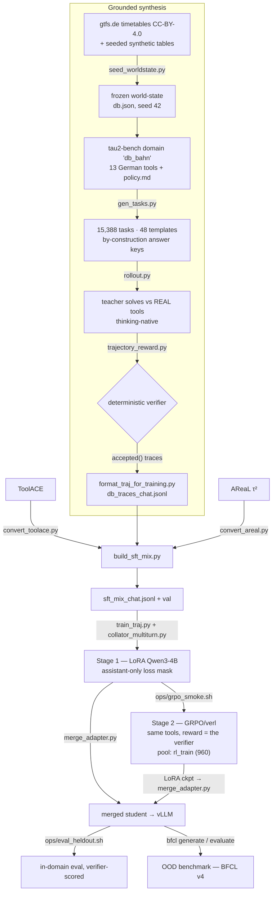

# Agentic SLM Training Pipeline

> Training a **small-language-model orchestrator agent** — multi-step planning, tool-calling and
> self-reflection/replan — for an internal **Deutsche Bahn employee assistant**.


## What is this?

A full training pipeline for a **4B agent** that drives real German DB tools — *Fahrplan*,
*Zugstandort*, *Wartung*, *Personal* — planning across several tool calls, recovering from errors
and replanning when a tool rejects an action. It runs on a single **GB10 (DGX Spark, 128 GB unified
memory, sm_121)** with vLLM serving and a [τ²-bench](https://github.com/sierra-research/tau2-bench)
tool sandbox.

Two training stages, both grounded in the same domain:

1. **Stage 1 — SFT (LoRA)** on a **3-leg mix**: public tool-calling breadth (ToolACE), τ²-bench
   dialogue flows (AReaL), and — the core of this repo — **self-synthesized, verifier-gated German
   DB trajectories with native thinking**.
2. **Stage 2 — GRPO/verl RL** against the same db_bahn tools, reward = the same deterministic
   trajectory verifier, tasks from the `rl_train` split of the same pool.

## Architecture

Generate tasks whose correct answer is **known by construction**, let a strong teacher solve them
against the *real* tools with thinking enabled, and keep only trajectories a deterministic verifier
confirms. Those verified German trajectories are mixed with two public legs before the student sees
them.



## The db_bahn domain

- **Frozen world-state.** Real [gtfs.de](https://gtfs.de) *de_fv* timetables (CC-BY-4.0) plus
  `sha256`-seeded synthetic tables (vehicles, staff, shifts, maintenance) → one byte-reproducible
  `db.json` (seed 42).
- **A τ²-bench domain, `db_bahn`.** 13 German tools with a German `policy.md`, *runtime-registered*
  so the upstream tau2 source stays untouched. WRITE tools enforce real rules (role-gate, product
  qualification, duplicate-gate, terminal status) → rejected actions force the agent to **replan**.
  Search pages at 10 hits, `mitarbeiter_suchen` resolves ambiguous names, `anschluss_pruefen` does
  transfer-time math; injectable faults include data gaps and **transient errors** (retry mandated
  by policy, never hinted in the ticket).
- **48 task templates** with **by-construction answer keys** — INFO + ACTION + **REFUSAL** (correct
  answer: change nothing, justify), batch/parallel tickets, iteration-over-hits, aggregation,
  cascades, Umlauf ambiguity, >10-hit refinement. Tickets state goals and anchors, **not
  tool-by-tool recipes**. ~43 % carry faults (`state` / `runtime` / `state+runtime` / `transient`).
- **Thinking-native generation** ([rollout.py](sdg_pipeline/db_bahn/rollout.py)): reasoning is
  captured inline as `<think>…</think>`, parallel multi-call turns are possible, and a token-capped
  or looping think counts as a **failed attempt** — re-rolled via `branch-on-fail` / `k=2` top-up /
  `B2` recovery-harvest.
- **A deterministic outcome-verifier**
  ([evaluation/trajectory_reward.py](evaluation/trajectory_reward.py)): DB-state hash +
  tool-grounding + anti-hallucination + refusal gates (`no_write`, `no_forbidden`). Only
  `accepted()` trajectories survive; `format_traj` additionally drops truncated/degenerate/≥3×-call
  traces. Self-test: 21 cases.

**Tools (13)**

| Category | # | Tools |
|----------|---|-------|
| Lookup (READ, by id) | 6 | `fahrplan`, `verspaetung`, `zugstandort`, `wartung_status`, `mitarbeiter_info`, `mitarbeiter_details` |
| Search (READ, by filter) | 3 | `zuege_suchen`, `mitarbeiter_suchen` (incl. `name`), `wartung_liste` |
| Compute (READ) | 1 | `anschluss_pruefen` (transfer feasibility incl. live delays) |
| Write (rule-gated) | 3 | `wartung_einplanen`, `crew_zuweisen`, `wartung_status_setzen` |

**Splits** (from `gen_tasks.py`; disjoint by construction, HARD-FAIL-checked; **uniform per
template** — so every class is individually measurable and equally represented in RL)

| Split | Tasks | Rule | Purpose |
|-------|-------|------|---------|
| `sft_train` | 13,948 | rest | teacher rollouts → SFT traces |
| `rl_train` | 960 | 20 / template | Stage-2 GRPO pool |
| `heldout_eval` | 480 | 10 / template | before/after held-out eval |
| `bakeoff_dev` | 48 | 1 / template | smoke/dev subset (⊆ `sft_train`) |

## Setup

Prereqs: Docker + Compose (services `sdg`, `training`, `vllm`, `grpo`, `mlflow`) and a **Python
≥ 3.12 venv for τ²-bench** (its `requires-python >=3.12`; the pinned training stack stays isolated).

```bash
python3.12 -m venv .venv-tau2
git clone https://github.com/sierra-research/tau2-bench.git /tmp/tau2-bench   # pin commit 1901a30
./.venv-tau2/bin/pip install /tmp/tau2-bench
```

All `ops/` scripts use `.venv-tau2/` by default (override with `TAU2PY=/path/to/python`).
`config/pipeline_config.yaml` is the single config — no secrets needed (the teacher is local vLLM).

**Import convention:** scripts import the shared `data_pipeline/common.py`, so host invocations need
the repo root on the path — prefix with `PYTHONPATH=.` (as the examples do), or install once via
`pip install -e . --no-deps` (containers bake `PYTHONPATH=/app`).

## Running the pipeline

**CPU** (host `python3` unless marked `[TAU2PY]`):

```bash
# 0) public legs -> data/raw/{toolace,areal}/   (areal = ~970 MB snapshot)
PYTHONPATH=. python3 data_pipeline/prepare_agentic_data.py --config config/pipeline_config.yaml --dataset all
PYTHONPATH=. ./.venv-tau2/bin/python data_pipeline/validate_areal.py --config config/pipeline_config.yaml

# 1) frozen world-state from the GTFS snapshot (byte-reproducible, seed 42)
python3 sdg_pipeline/db_bahn/seed_worldstate.py --gtfs-dir data/raw/db_sandbox/gtfs_de_fv \
  --out data/raw/db_sandbox/db.json --seed 42

# 2) tasks + answer keys + uniform splits (defaults reproduce the golden artifacts)   [TAU2PY]
PYTHONPATH=. ./.venv-tau2/bin/python sdg_pipeline/db_bahn/gen_tasks.py --seed 42

# 3) GPU-free end-to-end smoke: scripted oracle through the REAL loop + verifier      [TAU2PY]
#    (--max-turns 15 is required — the depth templates need up to 13 calls)
PYTHONPATH=. ./.venv-tau2/bin/python sdg_pipeline/db_bahn/rollout.py \
  --dry-run --split bakeoff_dev --max-turns 15 --output /tmp/oracle_smoke.jsonl

# selftests
PYTHONPATH=. ./.venv-tau2/bin/python evaluation/trajectory_reward.py     # verifier (21 cases)
docker compose -f docker/docker-compose.yml run --rm -T training \
  python3 training_pipeline/collator_multiturn.py                        # loss-mask golden test
```

**GPU** (sequential — GB10 has no MIG, serve one model at a time):

```bash
bash ops/teacher_bakeoff.sh     # compare teacher candidates on bakeoff_dev
bash ops/gen_traces.sh          # serve winner -> thinking rollout over sft_train (k=1 branch-on-fail)
                                #   -> k=2 top-up -> format -> data/final/
                                #      db_traces_chat.jsonl                  (the SFT input)
                                #      db_failed-for-SFT_rl-candidates.jsonl (tasks in no trace ->
                                #                                            Stage-2 pool candidates)
                                #   (defaults: ctx 20480, concurrency 48, 72 h cap; ~41 h on GB10)
```

`gen_traces.sh` runs 40+ hours — start it detached, with the watchdog next to it:

```bash
tmux new-session -d -s sdg -c "$PWD"
tmux send-keys -t sdg:0.0 'bash ops/gen_traces.sh > logs/gen_traces.log 2>&1' Enter
tmux split-window -t sdg:0 -v -c "$PWD" \; send-keys 'ops/watch_gen.sh' Enter
```

`ops/watch_gen.sh` writes progress, rate, ETA and server health to `logs/gen_watch.log` every 10 min
and flags a stall if the trace file stops growing for 30 min. The rollout itself is resume-safe:
rerunning the script continues where it stopped.

**Mix + train** (`build_sft_mix.py` needs `db_traces_chat.jsonl` from the step above):

```bash
PYTHONPATH=. python3 data_pipeline/convert_toolace.py     # bracket-DSL -> toolace_chat.jsonl
docker compose -f docker/docker-compose.yml run --rm -T training \
  python3 data_pipeline/convert_areal.py                  # per-turn rows -> episodes -> areal_chat.jsonl
PYTHONPATH=. python3 data_pipeline/build_sft_mix.py       # -> sft_mix_chat.jsonl + sft_mix_val.jsonl

bash ops/traj_sft_pipeline.sh   # BEFORE-eval -> traj_sft -> merge x2 -> AFTER-eval x2
                                #   -> checkpoint-selection (ep1 vs ep2)
bash ops/grpo_smoke.sh          # Stage 2: verl tool-agent loop vs the real db_bahn tools
```

**In-domain eval, standalone** — any model (base, merged checkpoint, experiment), single-shot over the
480 `heldout_eval` tasks, printing a per-template yield table:

```bash
bash ops/eval_heldout.sh Qwen/Qwen3-4B base_think
python3 evaluation/eval_report.py --input <eval.jsonl> [--baseline <eval.jsonl>]   # re-report / delta
```

`traj_sft_pipeline.sh` calls the same script for the BEFORE and both AFTER evals, so those numbers are
comparable by construction.

**OOD benchmark (BFCL v4)** — external harness in its own venv, identical seed-42 IDs per model. It
sends the `Qwen3-4B-Instruct-2507` handler name in the payload, so the served-name **alias is
mandatory**:

```bash
python3.12 -m venv .venv-bfcl && .venv-bfcl/bin/pip install -r evaluation/benchmarks/bfcl/requirements.txt
.venv-bfcl/bin/python evaluation/benchmarks/bfcl/make_sample_ids.py

VLLM_MODEL="Qwen/Qwen3-4B" VLLM_MAX_MODEL_LEN=32768 VLLM_GPU_UTIL=0.85 \
  VLLM_EXTRA_ARGS="--max-num-seqs 16 --served-model-name Qwen/Qwen3-4B-Instruct-2507" \
  docker compose -f docker/docker-compose.yml --profile vllm up -d vllm

export BFCL_PROJECT_ROOT=$PWD/data/generated/bfcl_quickrun/base LOCAL_SERVER_PORT=8000
mkdir -p $BFCL_PROJECT_ROOT && cp evaluation/benchmarks/bfcl/mt.json $BFCL_PROJECT_ROOT/test_case_ids_to_generate.json
.venv-bfcl/bin/bfcl generate --model Qwen/Qwen3-4B-Instruct-2507-FC --run-ids --skip-server-setup \
  --temperature 0.6 --num-threads 16
.venv-bfcl/bin/bfcl evaluate --model Qwen/Qwen3-4B-Instruct-2507-FC --partial-eval --test-category <cats>
```

## Training recipe (Stage 1)

What `ops/traj_sft_pipeline.sh` launches:

| Knob | Value | Why |
|------|-------|-----|
| Base | **Qwen/Qwen3-4B** (dense, text-only, thinking) | no multimodal baggage; verl-GRPO-proven on sm_121 |
| LoRA | **r=32 / α=64**, all 7 linear modules | capacity for a broad task (3 domains + tools + German) |
| Seq len | **12,288** | AReaL episodes run long; truncating them costs quality |
| Batch | micro **8** × accum **2** = **eff. 16** | micro 16 was tested → *slower* (padding/saturation) |
| Epochs | **2**, cosine, lr 2e-4, warmup 3 % | + checkpoint-selection ep1-vs-ep2 |
| Speed | **FA2** + **Liger** (fused CE) + `group_by_length` | Liger is **required** for micro > 4 @ 12k (removes the 55 GB fp32 logit tensor) |
| Regularization | **NEFTune α=5** | noisy input embeddings, train-time only ([arXiv:2310.05914](https://arxiv.org/abs/2310.05914)) |
| Eval | held-out val + `eval_steps 300` | overfit diagnostic only — the real judge is the rollout `verified_yield` |

## Repo layout

```text
sdg_pipeline/db_bahn/            grounded synthesis
├── seed_worldstate.py           GTFS + seeded tables -> frozen db.json
├── gen_tasks.py                 template registry, answer keys, splits
├── gen_tasks_lib.py             eligibility pools + ticket building blocks
├── gen_templates_easy.py        ┐
├── gen_templates_hard.py        ├ the 48 templates
├── gen_templates_wave3.py       ┘
├── rollout.py                   rollouts vs the real tools
├── bakeoff_summary.py           teacher comparison table
└── tau2_domain/                 13 tools, policy.md, world data model

data_pipeline/                   raw data -> training jsonl
├── prepare_agentic_data.py      fetch ToolACE + AReaL
├── validate_areal.py            schema / integrity / referential checks
├── convert_toolace.py           bracket-DSL -> chat
├── convert_areal.py             per-turn rows -> episodes
├── format_traj_for_training.py  rollouts -> chat, split-aware gates
├── build_sft_mix.py             3-leg mix + stratified val split
└── common.py                    shared helpers

training_pipeline/               Stage 1 SFT · Stage 2 verl seams
├── train_traj.py                LoRA SFT
├── collator_multiturn.py        assistant-only loss mask
├── build_grpo_pool.py           rl_train subset -> verl parquet
├── grpo_db_bahn_tools.py        the tau2 tools as verl BaseTools
└── grpo_tool_config.yaml        verl tool registry

evaluation/
├── trajectory_reward.py         the verifier = the Stage-2 reward
├── grpo_reward.py               verl seam: episode text -> messages
├── eval_report.py               per-template yield table, optional baseline delta
└── benchmarks/bfcl/             seed-42 sample IDs + generator

serving/merge_adapter.py         LoRA -> merged sharded model
tools/quantize_fp8.py            FP8 deploy quantization
ops/                             teacher_bakeoff · gen_traces · watch_gen · eval_heldout ·
                                 traj_sft_pipeline · grpo_smoke
docker/                          GB10 sm_121 stack
config/pipeline_config.yaml      the single config
data/, archive/                  [gitignored]
```

## GB10 / sm_121 load-bearing flags

Mandatory on this box: FlashInfer sampler off (top-k/top-p race), `--gdn-prefill-backend triton`
**for the hybrid-GDN teacher only** (never for the dense 4B student), sharded merges
(`max_shard_size=5GB`), no MIG → serve one model at a time. For Stage 2 additionally:
`load_format=auto` (else the rollout serves random weights), `attn_implementation=sdpa` (FA2 fails
the actor forward on sm_121) and `rollout.agent.default_agent_loop=tool_agent` (`multi_turn.enable`
alone is a no-op). All applied in the `ops/` scripts.
