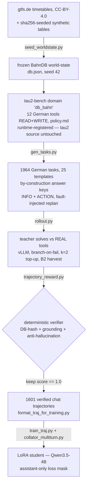

# Agentic SLM Training Pipeline

> Training a **small-language-model orchestrator agent** — multi-step planning, tool-calling and
> self-reflection/replan — for an internal **Deutsche Bahn employee assistant**.


## What is this?

A full training pipeline for a **4B agent** that drives real German DB tools — *Fahrplan*, *Zugstandort*,
*Wartung*, *Personal* — planning across several tool calls, recovering from errors and replanning when a
tool rejects an action. It runs on a single **GB10 (DGX Spark, 128 GB unified memory, sm_121)** with vLLM
serving and a [τ²-bench](https://github.com/sierra-research/tau2-bench)-based tool sandbox. It is the
successor of the finished Text-to-SQL pipeline (archived under [docs/text2sql-experiments/](docs/text2sql-experiments/)).

**Two-stage training plan**

1. **Stage 1 — SFT (LoRA)** on a **4-leg data mix**: public tool-calling + planning sets, τ²-bench dialogue
   flows, and — the core of this repo — **self-synthesized, verifier-gated German DB trajectories**.
2. **Stage 2 — GRPO/verl RL**, reward = the same deterministic trajectory verifier / τ²-bench success.

## Architecture — Stage-1 grounded synthesis

The core idea: **generate tasks whose correct answer is known by construction**, let a strong teacher solve
them against the *real* tools, and keep only trajectories a deterministic verifier confirms.



## The SFT data mix (4 legs)

| # | Leg | Source | Teaches | Size / status |
|---|-----|--------|---------|---------------|
| 1 | ToolACE | [`Team-ACE/ToolACE`](https://huggingface.co/datasets/Team-ACE/ToolACE) | tool-call basics | 11,300 rows |
| 2 | TaskBench | [`microsoft/Taskbench`](https://huggingface.co/datasets/microsoft/Taskbench) | planning / decomposition (tool-graph) | 17,331 rows |
| 3 | AReaL (τ²-bench flows) | [`inclusionAI/AReaL-tau2-data`](https://huggingface.co/datasets/inclusionAI/AReaL-tau2-data) | multi-turn dialogue / policy adherence | 33,531 SFT (+1,982 RL tasks) |
| 4 | **db_bahn** ⭐ | self-synthesized (this repo) | verifier-gated German DB trajectories | **1,601 verified** |

Legs 1–3 are public sets pulled and validated locally; **leg 4 is the heart of this repo** — see below.

## The db_bahn synthesis core

- **Frozen world-state.** Real [gtfs.de](https://gtfs.de) *de_fv* timetables (CC-BY-4.0) plus `sha256`-seeded
  synthetic tables (vehicles, staff, shifts, maintenance) → one byte-reproducible `db.json` (seed 42).
- **A τ²-bench domain, `db_bahn`.** **12 German tools** (READ + WRITE) with a German `policy.md`, *runtime-registered*
  so the upstream tau2 source stays untouched. WRITE tools enforce real rules (role-gate, product qualification,
  duplicate-gate, terminal status) → rejected actions force the agent to **replan**.
- **25 task templates** with **by-construction answer keys** (INFO + ACTION; ~41 % carry an injected fault).
- **A deterministic outcome-verifier** ([evaluation/trajectory_reward.py](evaluation/trajectory_reward.py)):
  DB-state hash + tool-grounding + anti-hallucination → only `score == 1.0` trajectories survive.
- **Robust rollout** ([sdg_pipeline/db_bahn/rollout.py](sdg_pipeline/db_bahn/rollout.py)): `branch-on-fail`
  (rewind to the gold-path prefix, resample the tail), `k=2` top-up on the failed subset, and `B2` recovery-harvest
  (keep a mistake **and** its correction → self-correction traces). Everything is logged to MLflow (file-store).

**Tools (12)**

| Category | # | Tools |
|----------|---|-------|
| Lookup (READ, by id) | 6 | `fahrplan`, `verspaetung`, `zugstandort`, `wartung_status`, `mitarbeiter_info`, `mitarbeiter_details` |
| Search (READ, by filter) | 3 | `zuege_suchen`, `mitarbeiter_suchen`, `wartung_liste` |
| Write (rule-gated) | 3 | `wartung_einplanen`, `crew_zuweisen`, `wartung_status_setzen` |

**Splits** (from `gen_tasks.py`; disjoint by construction, HARD-FAIL-checked)

| Split | Tasks | Purpose |
|-------|-------|---------|
| `sft_train` | 1,610 | teacher rollouts → SFT traces |
| `rl_train` | 295 | Stage-2 GRPO |
| `heldout_eval` | 59 | before/after held-out eval |
| `bakeoff_dev` | 25 | teacher bake-off + CPU smoke (⊆ `sft_train`, non-disjoint) |

Pool: **1,964 unique tasks** (`sft`/`rl`/`heldout` disjoint; `bakeoff_dev` is a stratified subset of `sft_train`).

## Setup

Prereqs: Docker + Compose (services: `sdg`, `training`, `vllm`, `grpo`, `mlflow`) and a **Python ≥ 3.12 venv
for τ²-bench** (its `requires-python >=3.12`; the pinned training stack stays isolated per the repo's venv doctrine).

```bash
python3.12 -m venv .venv-tau2
git clone https://github.com/sierra-research/tau2-bench.git /tmp/tau2-bench   # pin commit 1901a30
./.venv-tau2/bin/pip install /tmp/tau2-bench
cp config/pipeline_config.yaml config/pipeline_config.local.yaml             # then fill secrets (gitignored)
```

All `ops/` scripts use `.venv-tau2/` by default (override with `TAU2PY=/path/to/python`).

## Pipeline steps

**CPU** (host `python3` unless noted `[TAU2PY]`):

```bash
# 0) public SFT legs -> data/raw/{toolace,taskbench,areal}/   (areal = ~970 MB snapshot)
python3 data_pipeline/prepare_agentic_data.py --config config/pipeline_config.yaml --dataset all

# 0b) validate the AReaL leg (streaming schema/integrity/referential checks -> validation_report.json)
./.venv-tau2/bin/python data_pipeline/validate_areal.py \
  --config config/pipeline_config.local.yaml --deep

# 1) frozen world-state from the GTFS snapshot (byte-reproducible, seed 42)
python3 sdg_pipeline/db_bahn/seed_worldstate.py --gtfs-dir data/raw/db_sandbox/gtfs_de_fv \
  --out data/raw/db_sandbox/db.json --seed 42

# 2) tasks + answer keys + disjoint splits (bakeoff_dev / heldout_eval / rl_train / sft_train)   [TAU2PY]
PYTHONPATH=. ./.venv-tau2/bin/python sdg_pipeline/db_bahn/gen_tasks.py --seed 42

# 3) GPU-free end-to-end smoke: scripted oracle through the REAL loop + verifier   [TAU2PY]
PYTHONPATH=. ./.venv-tau2/bin/python sdg_pipeline/db_bahn/rollout.py \
  --dry-run --split bakeoff_dev --output /tmp/oracle_smoke.jsonl

# selftests
PYTHONPATH=. ./.venv-tau2/bin/python evaluation/trajectory_reward.py            # verifier (8 cases)
docker compose -f docker/docker-compose.yml run --rm -T training \
  python3 training_pipeline/collator_multiturn.py                              # loss-mask golden test
```

**GPU** (sequential — GB10 has no MIG, serve one model at a time):

```bash
bash ops/teacher_bakeoff.sh     # compare teacher candidates -> docs/teacher-bakeoff.md
bash ops/gen_traces.sh          # serve winner -> rollout sft_train (k=1 branch-on-fail) -> k=2 top-up
                                #   -> format -> data/final/db_traces_chat.jsonl   (the SFT input)
bash ops/traj_sft_pipeline.sh   # BEFORE-eval -> traj_sft (assistant-only mask) -> merge -> AFTER-eval
```

## Results & status

- **Teacher bake-off** over 8 local models → winner **Qwen3.6-35B-A3B** (92 % verified yield, ~16 s/rollout) —
  [docs/teacher-bakeoff.md](docs/teacher-bakeoff.md).
- **Latest generation run → 1,601 verified German trajectories** (99.4 % yield, all 25 templates): **55 %
  multi-tool** (≥ 3 calls), **41 % fault/replan**, **3.1 % emergent self-correction**, zero loops/dupes.
- **Held-out (honest):** wave-1 before/after was flat (72.5 % → 70 %, n = 40 — the base already solves the easy
  set; see the analysis in [docs/agentic-db-synthesis-log.md](docs/agentic-db-synthesis-log.md)). The wave-2
  train + re-baseline on `heldout_eval` (59) is the next step.

> **Next:** the domain now has a 12th tool (`mitarbeiter_details`, lookup-by-ID) that the 1,601-trace set predates.
> A single unified **12-tool regeneration** is queued, followed by SFT training, a fresh held-out re-baseline, and
> the Stage-2 GRPO re-wire.

## Repo layout

```
sdg_pipeline/db_bahn/        # world-state seeder, tau2 domain (12 tools/policy), task-gen, rollout, bake-off
  tau2_domain/               #   data_model, environment, tools.py (12 READ/WRITE), policy.md
evaluation/trajectory_reward.py   # deterministic trajectory verifier (Stage-2 reward seam, verl dict contract)
data_pipeline/               # prepare_agentic_data (ToolACE/TaskBench/AReaL), validate_areal,
                             # format_traj_for_training (split-aware), clean_traces
training_pipeline/           # train_traj (LoRA SFT), collator_multiturn (assistant-only mask),
                             # grpo_verl_runner + build_weak_pool + reachability_probe (Stage-2 verl recipe)
serving/                     # merge_adapter (text), merge_adapter_mm (multimodal — Qwen3.5 deploys)
tools/                       # close_rate_probe (termination probe), quantize_fp8 (deploy quant)
ops/                         # teacher_bakeoff, gen_traces, traj_sft_pipeline, grpo_pilot_supervised
docker/                      # sdg / training / vllm / grpo / mlflow services (GB10 sm_121 stack)
docs/                        # design docs, decision log, bake-off results + text2sql-experiments/ archive
```

## Docs

- [docs/agentic-datasets-explained.md](docs/agentic-datasets-explained.md) — **start here**: the big picture, all 4 legs explained (DE)
- [docs/agentic-db-synthesis-log.md](docs/agentic-db-synthesis-log.md) — decision & bug log, newest on top
- [docs/agentic-sft-db-synthesis.md](docs/agentic-sft-db-synthesis.md) — design + literature levers (9 papers)
- [docs/agentic-sft-data-basis.md](docs/agentic-sft-data-basis.md) — the public SFT data basis (acquisition record)
- [docs/agentic-pivot-overview.md](docs/agentic-pivot-overview.md) — what carried over from the Text2SQL base
- [docs/teacher-bakeoff.md](docs/teacher-bakeoff.md) — teacher comparison + winner validation
- [docs/text2sql-experiments/](docs/text2sql-experiments/) — archived evidence base of the predecessor pipeline

## GB10 / sm_121 load-bearing flags (inherited, verified)

`VLLM_USE_FLASHINFER_SAMPLER=0` (FlashInfer sampler race), `--gdn-prefill-backend triton` (DeltaNet MoEs),
`--max-num-seqs 4` (small-batch box), `VLLM_MAX_MODEL_LEN=12288` (12-tool system prompt headroom), sharded merges
(`max_shard_size=5GB`), no MIG → serve one model at a time. Stage-2 verl: `load_format=auto`,
`attn_implementation=sdpa`, ~9B colocated cap. Details in the [decision log](docs/agentic-db-synthesis-log.md).
